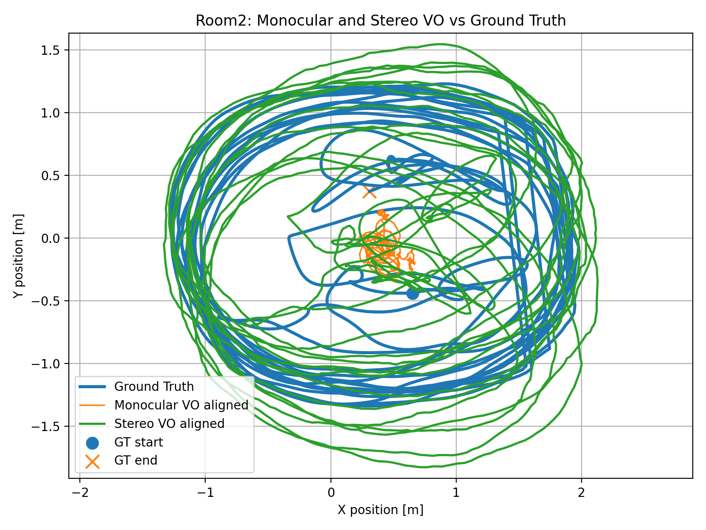
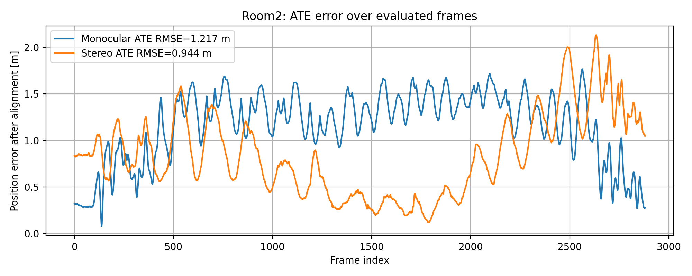
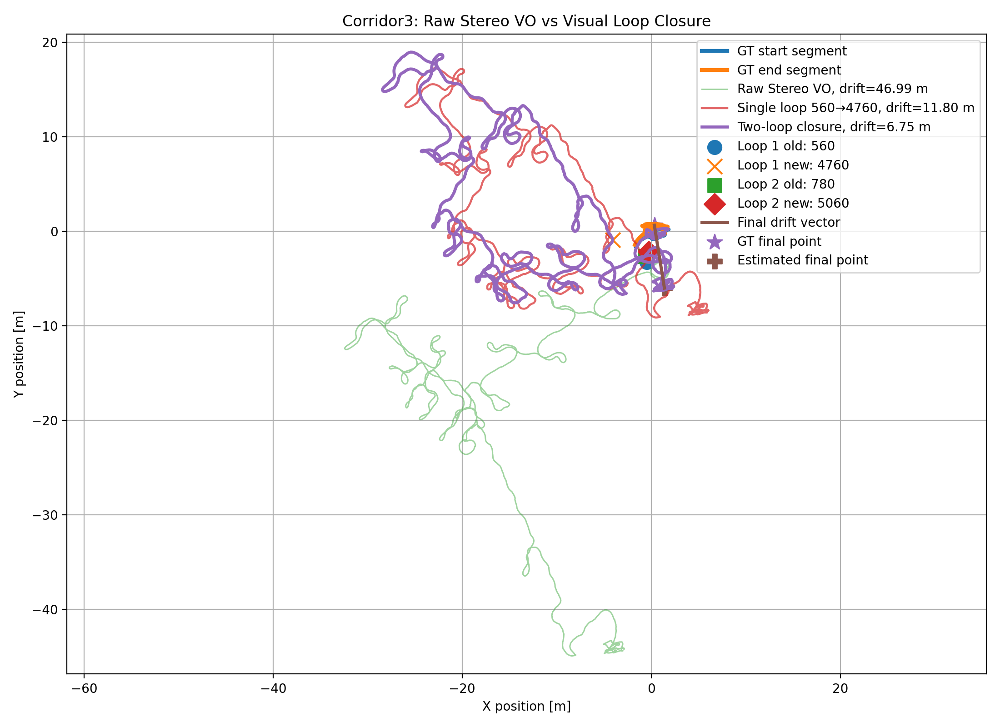
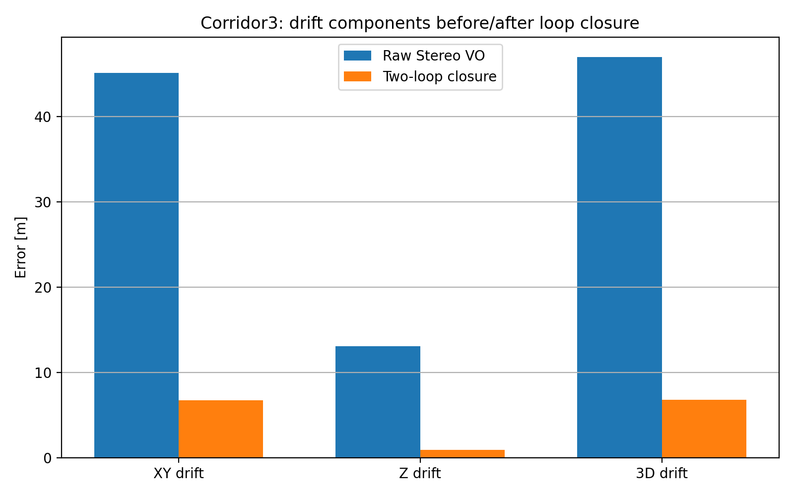
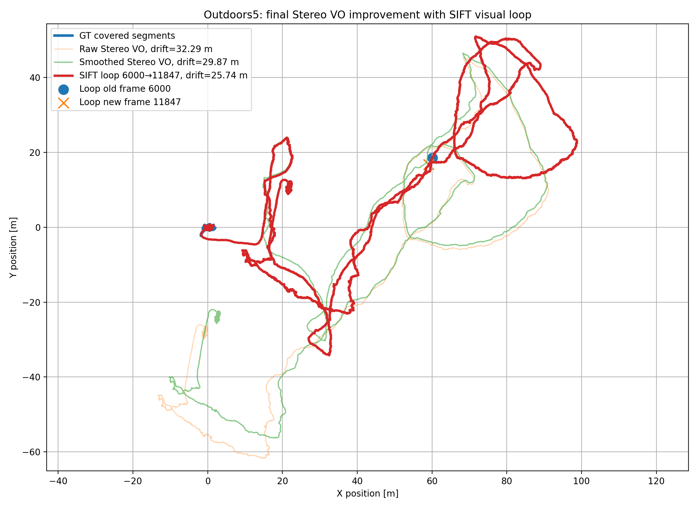
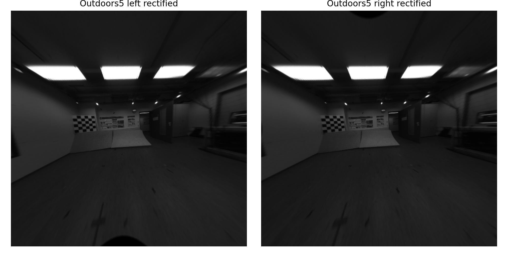

# Stereo Visual Odometry on TUM VI Sequences

This repository contains a classical **Stereo Visual Odometry (Stereo VO)** pipeline developed and evaluated on selected sequences from the **TUM VI dataset**. The project estimates camera motion from stereo image pairs and reconstructs the camera trajectory using feature matching, stereo geometry, pose estimation, and drift analysis.

The work compares monocular and stereo visual odometry behavior, studies trajectory drift, and evaluates correction strategies such as filtering, smoothing, and loop-based trajectory improvement.

---

## Project Overview

Visual Odometry estimates the motion of a camera by analyzing consecutive image frames. In this project, stereo image pairs are used to recover more stable depth information than monocular vision alone.

The main objective is to estimate the trajectory of a moving camera from image sequences and compare the estimated path against available reference or expected trajectory behavior.

---

## Methodology

The pipeline follows a classical computer vision approach:

```text
Stereo Image Pair
        ↓
Camera Calibration / Rectification
        ↓
Feature Detection and Matching
        ↓
Stereo Depth Estimation
        ↓
Pose Estimation using PnP + RANSAC
        ↓
Trajectory Reconstruction
        ↓
Drift / Error Analysis
        ↓
Result Visualization
```

The project focuses on interpretable geometric visual odometry rather than deep learning. This makes the pipeline easier to analyze scientifically because each stage can be inspected separately.

---

## Dataset Sequences

The experiments were conducted on selected TUM VI sequences:

| Sequence | Environment | Purpose |
|---|---|---|
| Room2 | Indoor room sequence | Monocular vs stereo comparison |
| Corridor3 | Indoor corridor sequence | Drift analysis and loop-based correction |
| Outdoors5 | Outdoor sequence | Long trajectory behavior and drift evaluation |

---

## Repository Structure

```text
Stereo_Visual_Odometry/
├── config/                  # Run/configuration files
├── notebooks/               # Final experiment notebooks
├── outputs/                 # Full generated outputs from experiments
├── stereo_vo/               # Main visual odometry source code
├── figures/                 # Clean figures used in the README
├── poster/                  # Poster preparation folder
│   ├── assets/              # Images selected for the scientific poster
│   ├── tables/              # CSV result tables for poster analysis
│   └── histograms/          # Histogram figures to be added for poster analysis
├── .gitignore
├── README.md
└── requirements.txt
```

---

## Selected Visual Results

### Room2: Monocular vs Stereo Trajectory

<p align="center">
  
</p>

This figure compares monocular and stereo trajectory estimation on the Room2 sequence. Stereo visual odometry provides additional depth information, which improves motion estimation compared with monocular-only estimation.

---

### Room2: ATE Error over Frames

<p align="center">
  
</p>

The Absolute Trajectory Error (ATE) plot shows how the trajectory error evolves over time. This is useful for identifying where drift begins to increase across the sequence.

---

### Corridor3: Raw, Single-Loop, and Two-Loop Trajectory

<p align="center">
  
</p>

The Corridor3 experiment highlights trajectory drift and the effect of loop-based correction. The two-loop strategy reduces the final trajectory drift compared with the raw visual odometry result.

---

### Corridor3: Drift Components

<p align="center">
  
</p>

This plot separates the trajectory drift into components, making it easier to analyze how the error changes across different motion directions.

---

### Outdoors5: Final Stereo Trajectory Result

<p align="center">
  
</p>

The Outdoors5 sequence is more challenging because it contains a longer outdoor trajectory. The result shows the effect of smoothing and SIFT-based loop correction on the estimated path.

---

### Outdoors5: Stereo Rectification Check

<p align="center">
  
</p>

Stereo rectification is an important preprocessing step. It aligns stereo image pairs so that corresponding points lie on the same horizontal scanlines, making stereo matching more reliable.

---

## Quantitative Results

| Sequence | Method / Result | Main Observation |
|---|---|---|
| Room2 | Monocular vs Stereo VO | Stereo VO improves trajectory stability compared with monocular VO |
| Corridor3 | Raw vs loop-corrected trajectory | Loop-based correction reduces drift |
| Outdoors5 | Raw, smoothed, and SIFT loop trajectory | Outdoor motion remains challenging but correction improves the trajectory |

The detailed numerical results are stored in:

```text
poster/tables/
outputs/room2_final_submission/tables/
outputs/corridor3_final_submission/tables/
outputs/outdoors5_final_submission/tables/
```

These CSV files are used for scientific analysis, table generation, and poster preparation.

---

## Poster Preparation

The repository also includes a dedicated poster preparation folder:

```text
poster/
├── assets/
├── tables/
└── histograms/
```

The final scientific poster will use:

- trajectory plots
- drift/error plots
- result tables
- histogram analysis
- stereo rectification visuals
- method pipeline summary

Histograms will be added to the poster to show the distribution of frame-level statistics such as feature counts, matching behavior, inlier behavior, and other visual odometry performance indicators.

---

## Installation

Create a Python environment and install the required dependencies:

```bash
pip install -r requirements.txt
```

---

## How to Run

The final experiments are available in the `notebooks/` folder. Open the notebooks and run the selected sequence experiment:

```text
notebooks/
```

Each notebook produces trajectory files, plots, and CSV result tables inside the corresponding output folder.

---

## Main Project Outputs

```text
outputs/
├── room2_final_submission/
├── corridor3_final_submission/
└── outdoors5_final_submission/
```

Each output folder contains:

```text
configs/        # experiment configuration
plots/          # trajectory and error plots
tables/         # quantitative CSV results
trajectories/   # estimated trajectory files
```

---

## Scientific Interpretation

The results show that stereo visual odometry provides more reliable motion estimation than monocular visual odometry because stereo vision gives direct depth information. However, trajectory drift still appears over longer sequences, especially in outdoor environments. Loop-based correction, filtering, and smoothing help reduce this drift and improve trajectory consistency.

---

## Conclusion

This project demonstrates a complete classical stereo visual odometry pipeline using real image sequences. The work covers image preprocessing, feature matching, pose estimation, trajectory reconstruction, drift analysis, and scientific result visualization. The final repository is organized for both technical review and scientific poster presentation.