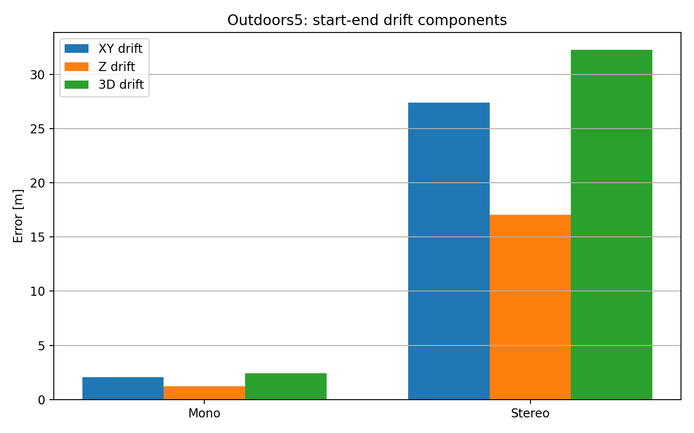

# Classical Stereo Visual Odometry on TUM VI Sequences

A complete classical computer vision pipeline for Monocular and Stereo Visual Odometry using the TUM VI benchmark, including stereo rectification, disparity-based depth estimation, PnP-RANSAC motion estimation, drift analysis, and loop-based correction experiments.

---

## Authors

- Theodore Petrick Reimmer
- Huseyn Huseynzade

---

## Final Deliverables

### Scientific Report
```text
Paper/stereo_vo_report.pdf
```

### Scientific Poster
```text
Poster/stereo_vo_Poster.pdf
Poster/stereo_vo_Poster.pptx
```

---

## Main Contributions

- Classical Monocular Visual Odometry baseline
- Metric Stereo Visual Odometry pipeline
- Stereo fisheye rectification
- Disparity-based metric depth estimation
- PnP + RANSAC pose estimation
- Trajectory reconstruction
- Drift analysis and evaluation
- Loop-based trajectory correction
- Scientific plots, tables, and poster presentation

---

## Main Results

| Sequence | Result |
|---|---|
| Room2 Stereo VO | ATE RMSE improved from **1.217 m → 0.944 m** |
| Room2 Stereo VO | RPE RMSE improved from **0.945 m → 0.339 m** |
| Corridor3 | Drift reduced from **46.99 m → 6.75 m** |
| Outdoors5 | Drift reduced from **32.29 m → 18.31 m** |

---

## Project Overview

Visual Odometry estimates camera motion from image sequences and is an important component of robotics, autonomous navigation, SLAM systems, and augmented reality. This project presents a complete transition from a Monocular Visual Odometry baseline to a metric Stereo Visual Odometry pipeline using only classical geometric computer vision methods.

The implementation uses:
- stereo rectification
- feature detection and matching
- disparity-based depth estimation
- Perspective-n-Point (PnP)
- RANSAC outlier rejection
- trajectory reconstruction
- drift analysis
- loop-based correction experiments

The project was evaluated on selected sequences from the TUM VI benchmark:
- Room2
- Corridor3
- Outdoors5

---

## Methodology Pipeline

```text
Stereo Image Pair
        ↓
Camera Calibration and Rectification
        ↓
Feature Detection and Matching
        ↓
Stereo Depth Estimation
        ↓
PnP + RANSAC Pose Estimation
        ↓
Trajectory Reconstruction
        ↓
Drift / Error Analysis
        ↓
Loop-based Correction and Smoothing
```

---

## Dataset Sequences

| Sequence | Environment | Purpose |
|---|---|---|
| Room2 | Indoor room | Monocular vs Stereo comparison |
| Corridor3 | Indoor corridor | Drift analysis and loop correction |
| Outdoors5 | Outdoor environment | Long trajectory evaluation |

---

## Visual Results

### Room2 Monocular vs Stereo Trajectory

<p align="center">
  
</p>

The Room2 sequence compares monocular and stereo trajectory estimation. Stereo Visual Odometry produced a more stable and consistent trajectory due to direct metric depth estimation from stereo disparity.

---

### Room2 Absolute Trajectory Error

<p align="center">
  
</p>

This plot shows the evolution of Absolute Trajectory Error (ATE) across the Room2 sequence.

---

### Corridor3 Loop-Corrected Trajectory

<p align="center">
  
</p>

Corridor3 demonstrates accumulated drift in long indoor trajectories. Visual loop correction significantly reduced the final drift.

---

### Corridor3 Drift Components

<p align="center">
  
</p>

This figure visualizes drift component behavior after trajectory correction.

---

### Outdoors5 Final Corrected Trajectory

<p align="center">
  
</p>

Outdoors5 is the most challenging sequence because of its long outdoor trajectory. Smoothing and SIFT-based loop correction improved overall trajectory consistency.

---

### Outdoors5 Drift Components

<p align="center">
  
</p>

Outdoor sequences accumulated larger drift over time, especially in long paths.

---

### Stereo Rectification Check

<p align="center">
  
</p>

Stereo rectification aligns corresponding epipolar lines before disparity estimation and stereo matching.

---

## Quantitative Summary

### Room2 Full Ground-Truth Evaluation

| Method | Alignment | ATE RMSE | RPE RMSE |
|---|---|---|---|
| Monocular VO | Sim(3) | 1.217 m | 0.945 m |
| Stereo VO | SE(3) | 0.944 m | 0.339 m |

Stereo Visual Odometry improved both ATE RMSE and RPE RMSE compared with the monocular baseline.

---

### Corridor3 Start-End Drift

| Method | Drift |
|---|---|
| Raw Stereo VO | 46.99 m |
| Stereo VO + Two Visual Loops | 6.75 m |

Visual loop correction significantly reduced accumulated trajectory drift.

---

### Outdoors5 Start-End Drift

| Method | Drift |
|---|---|
| Monocular VO baseline | 2.41 m |
| Raw Stereo VO baseline | 32.29 m |
| Stereo VO + Step Smoothing | 29.87 m |
| Stereo VO + Safe Soft SIFT Loop | 18.31 m |

The safe soft SIFT loop correction reduced outdoor drift while avoiding trajectory over-correction.

---

## Runtime Summary

| Dataset | Method | Frames | Runtime |
|---|---|---|---|
| Room2 | Monocular VO | 2882 | 10.15 s |
| Room2 | Stereo VO | 2882 | 11.84 s |
| Corridor3 | Monocular VO | 5802 | 154.96 s |
| Corridor3 | Stereo VO | 5802 | 284.05 s |
| Outdoors5 | Monocular VO | 17747 | 604.98 s |
| Outdoors5 | Stereo VO | 17747 | 1152.51 s |

Stereo VO required additional computation because of stereo depth estimation and PnP-based motion estimation.

---

## Main Challenges Encountered

### Fisheye Rectification
Directly using raw fisheye images produced unstable stereo matching and disparity. The fix was to apply official TUM VI fisheye stereo rectification.

### Disparity Noise
Weak texture and far-depth regions produced unstable disparity estimates. Depth filtering and disparity validation were introduced to improve stability.

### PnP Instability
Some frame pairs contained too few valid 3D–2D correspondences. Threshold filtering and reprojection-error filtering improved pose estimation robustness.

### False Loop Closures
Certain loop candidates reduced numerical drift while being visually incorrect. Loop validation therefore required geometric and visual verification.

### Loop Over-Correction
Strong loop correction sometimes distorted the trajectory. Soft correction gains reduced over-correction while still improving drift.

---

## Scientific Interpretation

Stereo Visual Odometry improves trajectory stability because stereo disparity directly constrains metric depth and scale. However, long sequences still accumulate drift, especially in outdoor environments. Corridor3 and Outdoors5 demonstrate that smoothing and loop-based correction can significantly improve trajectory consistency and reduce accumulated drift.

The experiments also show that monocular trajectories can appear numerically strong after Sim(3) alignment while still lacking true metric scale consistency.

---

## Repository Structure

```text
Stereo_Visual_Odometry/
├── Paper/
│   └── stereo_vo_report.pdf
│
├── Poster/
│   ├── stereo_vo_Poster.pdf
│   └── stereo_vo_Poster.pptx
│
├── figures/
├── outputs/
├── poster/
├── stereo_vo/
├── README.md
└── requirements.txt
```

---

## Repository Contents

The repository includes:
- final scientific report
- final scientific poster
- reproducible output files
- trajectory exports
- evaluation tables
- drift analysis plots
- loop correction experiments
- stereo rectification validation
- monocular and stereo VO pipelines

---

## Conclusion

This project demonstrates a complete classical progression from Monocular Visual Odometry to metric Stereo Visual Odometry using the TUM VI benchmark.

The Stereo VO pipeline improved trajectory consistency compared with the monocular baseline by leveraging calibrated stereo depth. Loop-based correction experiments further reduced accumulated drift in long trajectories, especially on Corridor3 and Outdoors5.

Although the implementation is not a complete SLAM system and does not include global optimization or bundle adjustment, it successfully demonstrates the practical strengths and limitations of classical geometric visual odometry.

---

## Future Work

Possible future improvements include:
- full loop closure integration
- bundle adjustment
- pose graph optimization
- relocalization
- SLAM back-end integration
- comparison with learned VO methods
- hybrid visual-inertial approaches

---

## Keywords

Stereo Visual Odometry, Monocular Visual Odometry, TUM VI, Stereo Vision, PnP, RANSAC, Disparity Estimation, Trajectory Reconstruction, Drift Analysis, Loop Closure, Computer Vision

---

## Citation

```text
H. Huseynzade and T. P. Reimmer,
"Stereo Visual Odometry Project",
GitHub repository, 2026.
```